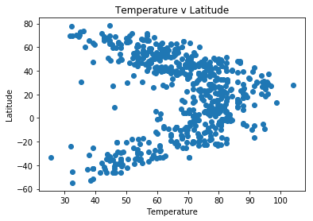
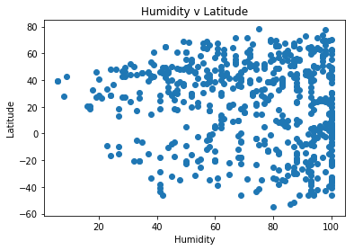
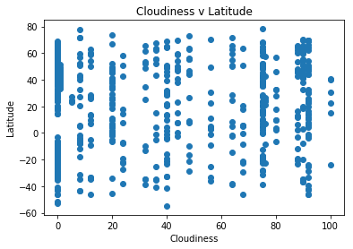
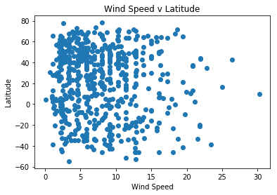

```python
import requests
from random import uniform
from pprint import pprint
from API_Keys import weather
from citipy import citipy
import pandas as pd
import matplotlib.pyplot as plt
```


```python
#Lists for Coordinates and Nearest Cities
coordinate=[]
cities=[]
```


```python
#Generate Random Coordinates
def newpoint():
   return uniform(-90,90), uniform(-180, 180)

points = (newpoint() for x in range(1800))
for point in points:
   coordinate.append(point)
```


```python
#Utilize Coordinates To Find Nearest Cities
for coordinate_pair in coordinate:
    lat, lon = coordinate_pair
    city=citipy.nearest_city(lat, lon)
    cities.append(city.city_name)
```


```python
#Add Data to DF and Limit to Uniques
city_df=pd.DataFrame({'City':cities})
print(len(city_df))
city_df=city_df.drop_duplicates('City')
print(len(city_df))
```

    1800
    669


```python
#URL and Params
url = "http://api.openweathermap.org/data/2.5/weather"
query_params = {
    'appid': weather,
    'units': 'imperial'
    }
```


```python
#ALL THE LISTS!!!
temp=[]
cloud=[]
wind=[]
humi=[]
lat=[]
lng=[]
```


```python
#ALL THE CLEAN DATA!!!
for city in city_df['City']:
    query_params['q'] = city
    response = requests.get(url, params=query_params).json()

    try:
        temp.append(response['main']['temp'])
        wind.append(response['wind']['speed'])
        cloud.append(response['clouds']['all'])
        humi.append(response['main']['humidity'])
        lat.append(response['coord']['lat'])
        lng.append(response['coord']['lon'])
    except KeyError:
        temp.append('NaN')
        wind.append('NaN')
        cloud.append('NaN')
        humi.append('NaN')
        lat.append('NaN')
        lng.append('NaN')
        
#    print(response)
#    excluded log due to length, but code is here if needed.
```


```python
#Check Length of List
len(lat)
```


    669


```python
#Add New Columns
city_df['Lat']=lat
city_df['Long']=lng
city_df['Temp']=temp
city_df['Cloud']=cloud
city_df['Wind']=wind
city_df['Humidity']=humi

city_df.head()
```


<div>
<style scoped>
    .dataframe tbody tr th:only-of-type {
        vertical-align: middle;
    }

    .dataframe tbody tr th {
        vertical-align: top;
    }

    .dataframe thead th {
        text-align: right;
    }
</style>
<table border="1" class="dataframe">
  <thead>
    <tr style="text-align: right;">
      <th></th>
      <th>City</th>
      <th>Lat</th>
      <th>Long</th>
      <th>Temp</th>
      <th>Cloud</th>
      <th>Wind</th>
      <th>Humidity</th>
    </tr>
  </thead>
  <tbody>
    <tr>
      <th>0</th>
      <td>dikson</td>
      <td>73.51</td>
      <td>80.55</td>
      <td>36.25</td>
      <td>20</td>
      <td>7.09</td>
      <td>97</td>
    </tr>
    <tr>
      <th>1</th>
      <td>castro</td>
      <td>-42.48</td>
      <td>-73.76</td>
      <td>46.24</td>
      <td>92</td>
      <td>9.44</td>
      <td>98</td>
    </tr>
    <tr>
      <th>2</th>
      <td>vestmannaeyjar</td>
      <td>63.44</td>
      <td>-20.27</td>
      <td>47.59</td>
      <td>48</td>
      <td>11.79</td>
      <td>95</td>
    </tr>
    <tr>
      <th>3</th>
      <td>paracuru</td>
      <td>-3.41</td>
      <td>-39.03</td>
      <td>80.6</td>
      <td>40</td>
      <td>9.17</td>
      <td>74</td>
    </tr>
    <tr>
      <th>4</th>
      <td>khatanga</td>
      <td>71.98</td>
      <td>102.47</td>
      <td>56.77</td>
      <td>64</td>
      <td>18.61</td>
      <td>95</td>
    </tr>
  </tbody>
</table>
</div>


```python
#Remove Rows with NaN
final_df=city_df[city_df.Lat != 'NaN']
```


```python
final_df.head()
```


<div>
<style scoped>
    .dataframe tbody tr th:only-of-type {
        vertical-align: middle;
    }

    .dataframe tbody tr th {
        vertical-align: top;
    }

    .dataframe thead th {
        text-align: right;
    }
</style>
<table border="1" class="dataframe">
  <thead>
    <tr style="text-align: right;">
      <th></th>
      <th>City</th>
      <th>Lat</th>
      <th>Long</th>
      <th>Temp</th>
      <th>Cloud</th>
      <th>Wind</th>
      <th>Humidity</th>
    </tr>
  </thead>
  <tbody>
    <tr>
      <th>0</th>
      <td>dikson</td>
      <td>73.51</td>
      <td>80.55</td>
      <td>36.25</td>
      <td>20</td>
      <td>7.09</td>
      <td>97</td>
    </tr>
    <tr>
      <th>1</th>
      <td>castro</td>
      <td>-42.48</td>
      <td>-73.76</td>
      <td>46.24</td>
      <td>92</td>
      <td>9.44</td>
      <td>98</td>
    </tr>
    <tr>
      <th>2</th>
      <td>vestmannaeyjar</td>
      <td>63.44</td>
      <td>-20.27</td>
      <td>47.59</td>
      <td>48</td>
      <td>11.79</td>
      <td>95</td>
    </tr>
    <tr>
      <th>3</th>
      <td>paracuru</td>
      <td>-3.41</td>
      <td>-39.03</td>
      <td>80.6</td>
      <td>40</td>
      <td>9.17</td>
      <td>74</td>
    </tr>
    <tr>
      <th>4</th>
      <td>khatanga</td>
      <td>71.98</td>
      <td>102.47</td>
      <td>56.77</td>
      <td>64</td>
      <td>18.61</td>
      <td>95</td>
    </tr>
  </tbody>
</table>
</div>


```python
plt.scatter(final_df['Temp'], final_df['Lat'])
plt.title("Temperature v Latitude")
plt.xlabel("Temperature")
plt.ylabel("Latitude")
plt.show()
```





```python
plt.scatter(final_df['Humidity'], final_df['Lat'])
plt.title("Humidity v Latitude")
plt.xlabel("Humidity")
plt.ylabel("Latitude")
plt.show()
```





```python
plt.scatter(final_df['Cloud'], final_df['Lat'])
plt.title("Cloudiness v Latitude")
plt.xlabel("Cloudiness")
plt.ylabel("Latitude")
plt.show()
```





```python
plt.scatter(final_df['Wind'], final_df['Lat'])
plt.title("Wind Speed v Latitude")
plt.xlabel("Wind Speed")
plt.ylabel("Latitude")
plt.show()
```





```python
final_df.to_csv('final.csv')
```


```python
#Observable trends
#Based on the first plot, we can clearly see that overall temperature drops as the location goes away from the equator.
#Wind Speed is fairly unaffected based on location from equator.
#Cloudiness is also fairly unaffected based on location from equator. 
```
